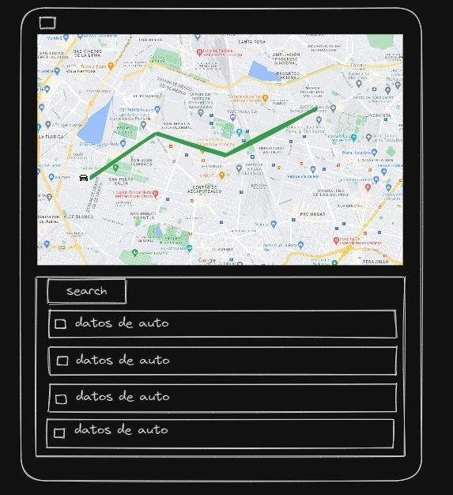

## Code Challenge

Summary: Create a web view that displays a map as the main section, followed by a list of vehicles and a search engine that affects that list.

## Section 1 - Map Styling and Representation

- The map must be the main element. Modify its style so that it is not the default.
- Implement dynamic zoom and centering based on the route's bounding box.
- Allow users to interact with the map, such as zooming in/out, dragging, and clicking on specific points for additional information.
- Add animations to the route representation on the map for a smoother visual experience. (Nice to have)

## Section 2 - Vehicle List

- Represents a list of vehicles (from [dummy vehicle list provided](assets/carMock.json)).
- Displays vehicle data in each row of the list.
- Enable sorting and filtering options for the vehicle list based on different criteria like vehicle type, status, or any other relevant attribute.
- Implement pagination for the vehicle list, especially if the list grows large.
- If feasible, incorporate real-time updates for the vehicle list, reflecting any changes in the "backend" data (This could be just ins the current session. Just a mock update). (Nice to have)

## Section 3 - Vehicle Details and Search Engine

- Clicking on each table item (vehicle) should display a clickable icon within the map (position must be near the route plotted on the map; any dummy position is valid).
- Add a search engine that affects the table (the more data the search engine takes into account, the better).
- Expand the information displayed on clicking a vehicle, providing more details about its status, history, or any other relevant data.
- Allow users to interact with the map directly from the table. Clicking on a vehicle in the table should highlight its position on the map.
- Enhance the search engine to support advanced filtering, allowing users to search based on multiple criteria simultaneously (Nice to have)

## Wireframe (low level) of the possible result

## Service

- Method: GET
- Endpoint: [https://5qewqsdgrl.execute-api.us-west-1.amazonaws.com//challenge/route/dummy](https://5qewqsdgrl.execute-api.us-west-1.amazonaws.com//challenge/route/dummy)

## Technologies

Ideally, we are looking for you to implement the challenge using the following technologies:

- TypeScript
- ReactJS
- Next.js
- You can choose any library for map rendering or other functionality.

## Deliverables

- URL of a live demo; we recommend Vercel, but any provider is valid.
- URL of the public GitHub repository.

## Estimated Time

This technical test is estimated to take approximately one and a half to two days to complete.

## Additional Resources

- [React Documentation](https://reactjs.org/docs/getting-started.html)
- [TypeScript Tutorial](https://www.typescriptlang.org/docs/)

## Extras - Optional

- Git flow.
- Clean code.
- Testing.
- Styling and finishing.
- Responsiveness
- Any improvement/functionality/extra styling will be taken into account.
- The layout is just a proposal, there is no limit in creativity.
- Proper error handling for API requests, ensuring a smooth user experience even if there are issues with data retrieval.
- Add loading states to indicate when data is being fetched, providing feedback to users.
- Write unit tests for critical components or functions to ensure code reliability.
- Optimize the application layout for different screen sizes, ensuring a good user experience on both desktop and mobile devices.
- Provide thorough documentation for the project, including setup instructions, architecture overview, and any other relevant information.
- Optimize the performance of the application, especially for rendering large datasets or handling complex interactions.

Remember to balance the time spent on each enhancement based on your skills and the overall time estimate for the test. Good luck!
